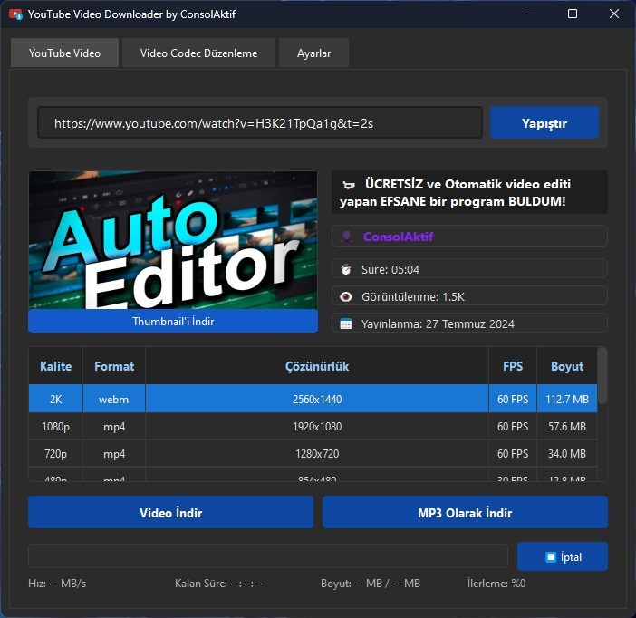
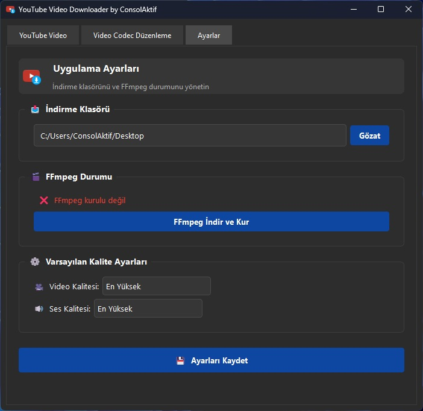

# 🎮 YouTube Video Downloader by ConsolAktif

YouTube ve diğer platformlardan video ve ses indirmenizi sağlayan **modern ve şık** bir uygulama! 🚀

| [](img/1.jpg) | [](img/2.jpg) |
| ------------------------------------- | ------------------------------------- |
| [](img/3.jpg) | [](img/4.jpg) |

## 📌 Özellikler

👉 YouTube videolarını ve ses dosyalarını hızlıca indirir.  
👉 Çeşitli format ve kalite seçenekleri sunar.  
👉 Kullanıcı dostu, şık ve modern bir arayüze sahiptir.  
👉 Video formatlarını dönüştürebilir (H.264, H.265, VP9, AV1).  
👉 **Tamamen ücretsiz ve açık kaynak!** 🎉

## 🛠️ Gereksinimler

Bu uygulamayı çalıştırmak için aşağıdaki bağımlılıklara ihtiyacınız vardır:

- Python 3.9 veya daha yeni bir sürüm
- `pip install -r requirements.txt`
- FFmpeg (Gerekirse program içinden indirilebilir)

## 🚀 Kurulum ve Kullanım

1. **Bağımlılıkları yükleyin:**
   ```sh
   pip install -r requirements.txt
   ```
2. **Uygulamayı çalıştırın:**
   ```sh
   python main.py
   ```

## 🛠️ PyInstaller ile .exe Dosyası Oluşturma

Eğer uygulamanın çalıştırılabilir bir `.exe` dosyasını oluşturmak istiyorsanız:

1. PyInstaller'ı yükleyin:
   ```sh
   pip install pyinstaller
   ```
2. `.exe` oluşturmak için aşağıdaki komutu çalıştırın:

   ```sh
   pyinstaller --noconsole --onefile --icon=icon.ico --name="YouTube Video Downloader by ConsolAktif" main.py
   ```

   **Açıklamalar:**

   - `--noconsole`: Komut penceresinin açılmasını engeller.
   - `--onefile`: Tek bir `.exe` dosyası oluşturur.
   - `--icon=icon.ico`: Özel bir simge ekler.
   - `--name="YouTube Video Downloader by ConsolAktif"`: `.exe` dosyasının adını belirler.

3. Oluşturulan `.exe` dosyası `dist` klasöründe yer alacaktır.

---

## 🐝 Katkıda Bulunun

Projeye katkıda bulunmak ister misiniz? Pull request veya issue oluşturabilirsiniz. ✨

## 📚 Lisans

Bu proje **MIT Lisansı** ile lisanslanmıştır.

---

**Eğer herhangi bir hata alırsanız, lütfen bildirin.** 📩  
🎥🎶 Keyifli kullanımlar dilerim!
