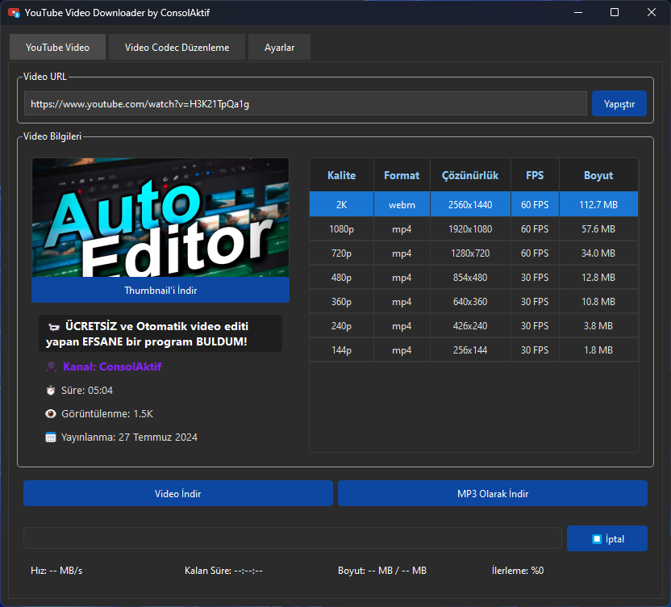

# 🎮 YouTube Video Downloader by ConsolAktif

A **modern and stylish** application that allows you to download videos and audio from YouTube and other platforms! 🚀

 <!-- If available, you can add a screenshot here -->

## 📌 Features

👉 Quickly downloads YouTube videos and audio files.  
👉 Offers various format and quality options.  
👉 Has a user-friendly, sleek, and modern interface.  
👉 Can convert video formats (H.264, H.265, VP9, AV1).  
👉 **Completely free and open-source!** 🎉

## 🛠️ Requirements

To run this application, you need the following dependencies:

- Python 3.9 or later
- `pip install -r requirements.txt`
- FFmpeg (Can be downloaded from within the program if necessary)

## 🚀 Installation and Usage

1. **Install dependencies:**
   ```sh
   pip install -r requirements.txt
   ```
2. **Run the application:**
   ```sh
   python main.py
   ```

## 🛠️ Creating an .exe File with PyInstaller

If you want to create a standalone `.exe` file for the application:

1. Install PyInstaller:
   ```sh
   pip install pyinstaller
   ```
2. Run the following command to create the `.exe` file:

   ```sh
   pyinstaller --noconsole --onefile --icon=icon.ico --name="YouTube Video Downloader by ConsolAktif" main.py
   ```

   **Explanation:**

   - `--noconsole`: Prevents the command window from opening.
   - `--onefile`: Creates a single `.exe` file.
   - `--icon=icon.ico`: Adds a custom icon.
   - `--name="YouTube Video Downloader by ConsolAktif"`: Sets the name of the `.exe` file.

3. The generated `.exe` file will be located in the `dist` folder.

---

## 🐝 Contribute

Would you like to contribute to the project? You can create a pull request or open an issue. ✨

## 📚 License

This project is licensed under the **MIT License**.

---

**If you encounter any errors, please let me know.** 📩  
🎥🎶 Enjoy using it!
