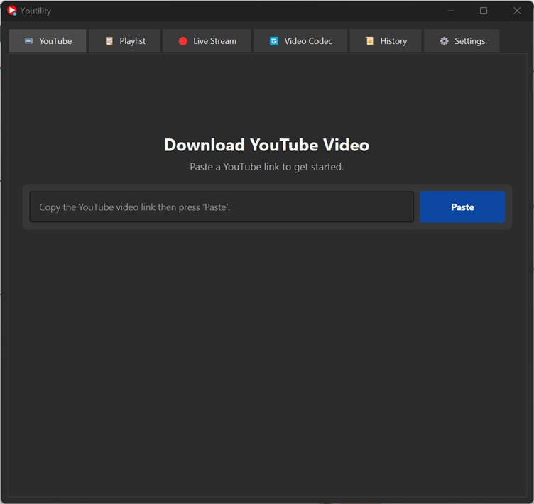
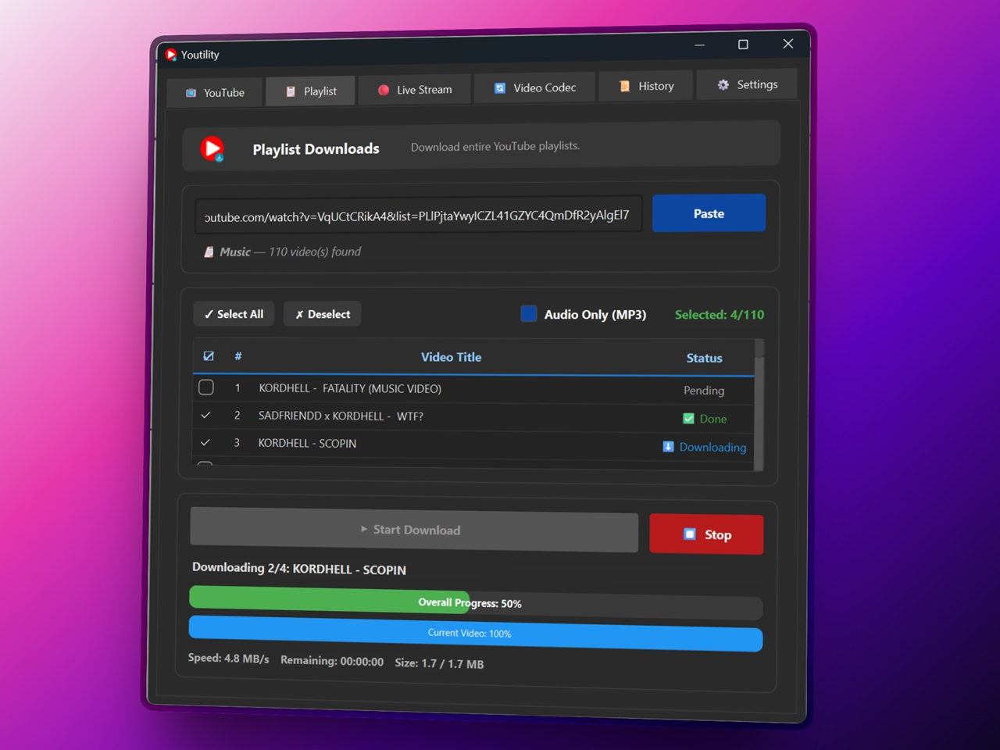
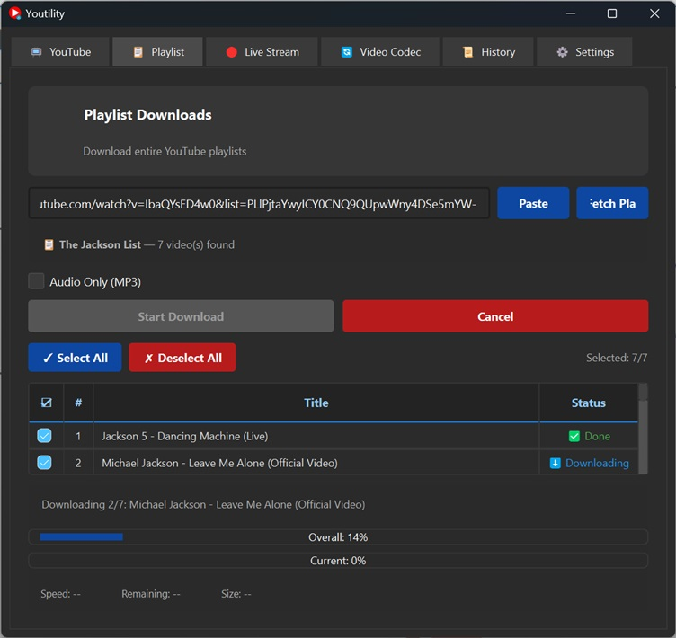
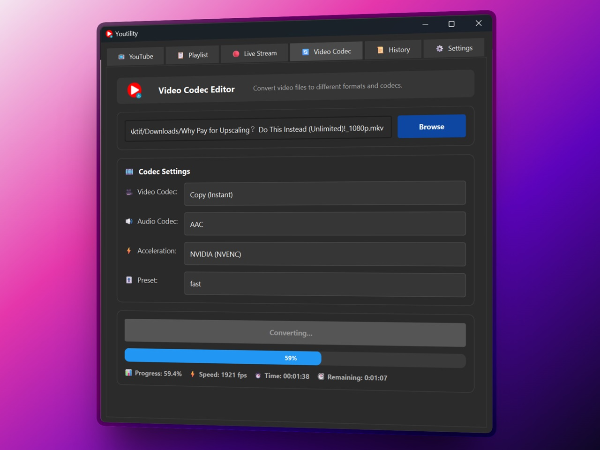

# 🔥 v5.0.0 Bigger, Smarter, Faster! 🚀

[](https://github.com/MuratGuelr/youtube_download_by_consolaktif/releases)
[](https://github.com/MuratGuelr/youtube_download_by_consolaktif/blob/main/LICENSE)
[](https://www.python.org)

---

A **modern and powerful** application that allows you to download videos, playlists, and live streams from YouTube — with built-in codec conversion and a sleek dark UI. 🚀

| [](img/1.jpg) | [](img/2.jpg) |
| ------------------------------------- | ------------------------------------- |
| [](img/3.jpg) | [](img/4.jpg) |

---

## 📌 Features

👉 Download YouTube videos in 144p up to 4K quality.  
👉 Download entire playlists with selective video picking.  
👉 Record and save YouTube live streams with fragment recovery.  
👉 Extract audio as MP3 with custom bitrate selection.  
👉 Download only a specific time range / segment of a video.  
👉 Convert video codecs (H.264, H.265, VP9, AV1) with GPU acceleration.  
👉 Convert audio codecs (AAC, MP3, Opus, FLAC).  
👉 Full download history with smart file path resolution.  
👉 Modern dark UI with system tray integration.  
👉 **Completely free and open-source!** 🎉

---

## ✨ What's New in v5.0.0

### 📋 Playlist Downloader

Download entire YouTube playlists or channels in one click. A dedicated tab lets you preview all videos, check/uncheck individual ones, and track per-video status (Pending / Downloading / Done / Error). Each playlist is saved into its own named subfolder automatically.

### 🔴 Live Stream Recorder

Record active YouTube live streams and DVR replays. The app displays stream info (title, channel, thumbnail, viewer count) before recording starts. Stopping mid-recording automatically merges all downloaded fragments via FFmpeg — no data is lost.

### ⏱ Time Range Download

Download only a specific segment of a video using start and end time inputs (HH:MM:SS). Fields are auto-filled from the video duration for convenience.

### 🎥 Smart YouTube Tab

- Paste button and Enter key both trigger info fetch
- Playlist URLs auto-redirect to the Playlist tab
- Live stream URLs auto-redirect to the Live Stream tab
- Thumbnail and video info load in background threads — UI never freezes
- Custom completion dialog with **Open File** and **Show in Folder** buttons

### 🎬 Improved Codec Editor

- New **Preset** selector (veryfast → veryslow) with hardware encoder mapping
- Real-time **compatibility hints** for codec/container mismatches
- Smart output container auto-selection (VP9 → `.webm`, AV1 → `.mkv`)
- **Intel/AMD VAAPI** support on Linux
- Automatic CPU fallback if GPU encoder fails

### 🐛 Key Bug Fixes

- MP3 conversion switched from `libshine` to `libmp3lame` (standard FFmpeg encoder)
- Playlist postprocessor hook crash (`pp` variable) fixed
- Intermediate files (`.f251.webm`, `.f396.mp4`) are now cleaned up after merge
- `DownloadManager` threading crash fixed (missing `self._lock`)
- History "File Not Found" false positives resolved

---

## 🚀 Getting Started

### Prerequisites

- **Python 3.8+**
- **FFmpeg** — installed and available in your system PATH

  To verify:

  ```bash
  ffmpeg -version
  ```

  > On Windows, FFmpeg can be installed automatically from the **Settings** tab inside the app.

- Required Python packages:
  - `yt_dlp`
  - `requests`
  - `PyQt6`

### Installation

1. **Clone the Repository:**

   ```bash
   git clone https://github.com/MuratGuelr/youtube_download_by_consolaktif.git
   cd youtube_download_by_consolaktif
   ```

2. **Install Dependencies:**

   ```bash
   pip install -r requirements.txt
   ```

3. **Run the Application:**
   ```bash
   python main-en.py
   ```

---

## 📦 Build as EXE (Windows)

```bash
pyinstaller --noconsole --onefile --hidden-import=yt_dlp --hidden-import=yt_dlp.extractor --hidden-import=yt_dlp.extractor.youtube --hidden-import=yt_dlp.utils --hidden-import=yt_dlp.networking --hidden-import=yt_dlp.networking.impersonate --hidden-import=websockets --hidden-import=certifi --hidden-import=urllib3 --hidden-import=requests --hidden-import=PyQt6 --hidden-import=PyQt6.QtCore --hidden-import=PyQt6.QtWidgets --hidden-import=PyQt6.QtGui --collect-all yt_dlp --name "Youtility" --icon=icon.ico --add-data "icon.ico;." --windowed main-en.py
```

> **Note:** `--collect-all yt_dlp` is required to bundle all YouTube extractors into the EXE. Without it, 403 errors may occur.

---

## 🗂 Tab Overview

| Tab            | Description                                                             |
| -------------- | ----------------------------------------------------------------------- |
| 📺 YouTube     | Single video download with format selection, time range, MP3 extraction |
| 📋 Playlist    | Full playlist download with selective video picking                     |
| 🔴 Live Stream | Record live streams and DVR replays with stop & recover                 |
| 🔄 Video Codec | Convert video/audio codecs with GPU acceleration                        |
| 📜 History     | View, open, and manage all past downloads                               |
| ⚙️ Settings    | Set download folder, FFmpeg status, default quality                     |

---

## 💻 System Requirements

| Requirement | Minimum                            |
| ----------- | ---------------------------------- |
| OS          | Windows 10/11, macOS 10.15+, Linux |
| Python      | 3.8 or higher                      |
| RAM         | 4 GB                               |
| FFmpeg      | Required (auto-install on Windows) |
| Internet    | Active connection required         |

---

## 🤝 Contributing

Contributions are welcome! Please fork the repository, make your changes, and open a pull request.  
See [CONTRIBUTING.md](CONTRIBUTING.md) for more details.

---

## 📄 License

This project is licensed under the MIT License. See [LICENSE](LICENSE) for details.

---

## 📬 Contact

For questions or suggestions, please open an issue on GitHub or contact [Murat Güler](mailto:desmeron134714@gmail.com).

---

_Youtility v5.0.0 — 2026 Made with ❤️ by ConsolAktif aka Murat Güler_
