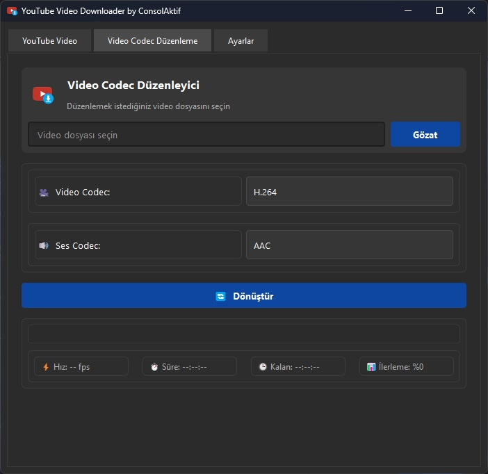

# 🔥 v4.0.0 Faster and Stronger! 🚀
[](https://github.com/MuratGuelr/youtube_download_by_consolaktif/releases)
[](https://github.com/MuratGuelr/youtube_download_by_consolaktif/blob/main/LICENSE)
[](https://www.python.org)

---

A **modern and stylish** application that allows you to download videos and audio from YouTube and other platforms! 🚀

| [](img/1.jpg) | [](img/2.jpg) |
| ------------------------------------- | ------------------------------------- |
| [](img/3.jpg) | [](img/4.jpg) |

## 📌 Features

👉 Quickly downloads YouTube videos and audio files.  
👉 Offers various format and quality options.  
👉 Has a user-friendly, sleek, and modern interface.  
👉 Can convert video formats (H.264, H.265, VP9, AV1).  
👉 **Completely free and open-source!** 🎉

Welcome to the next generation of our **YouTube Downloader**. This release is **faster, stronger, and smarter** than ever before!

### What's New

- **Faster MP3 Conversion:**  
  A two-step process that downloads the original audio and then uses FFmpeg with **libshine** (if supported) for a speeding up the MP3 conversion.
- **GPU-Accelerated Video Conversion:**  
  Leverages hardware-accelerated codecs (NVIDIA, AMD) when available for faster video processing.
- **Enhanced User Interface & Error Handling:**  
  Enjoy a sleek UI with smooth animations and detailed error messages.
- **Auto-Detection of Hardware:**  
  The application automatically detects your GPU to set the best conversion parameters.

### Getting Started

#### Prerequisites

- **Python 3.6+**
- **FFmpeg:**  
  Ensure FFmpeg is installed and in your system path.  
  To check for libshine support, run:
  ```bash
  ffmpeg -encoders | grep libshine
  ```
- Required Python packages:
  - `yt_dlp`
  - `requests`
  - `PyQt5` or `PyQt6`
  - `sqlite3` (included with Python)

#### Installation

1. **Clone the Repository:**
   ```bash
   git clone https://github.com/MuratGuelr/youtube_download_by_consolaktif.git
   cd youtube_download_by_consolaktif
   ```
2. **Install Dependencies:**
   ```bash
   pip install -r requirements.txt
   ```
3. **Run the Application:**
   ```bash
   python FinalBreakdown.py
   ```

### Feature Details

- **Video Downloads:**  
  Supports various formats and uses hardware acceleration (if available) for faster video conversion.
- **MP3 Downloads:**  
  Downloads the audio stream first, then manually converts it to MP3 using libshine.
- **Error Handling:**  
  Improved logging and robust error messages assist in troubleshooting issues.

### Troubleshooting

If you see errors (such as the `postprocessor_args` error), the manual conversion method is now used.  
Ensure your FFmpeg build includes libshine to enjoy faster MP3 encoding.

### Contributing

Contributions are welcome! Please fork the repository, make your changes, and open a pull request.  
See [CONTRIBUTING.md](CONTRIBUTING.md) for more details.

### License

This project is licensed under the MIT License. See [LICENSE](LICENSE) for details.

### Contact

For questions or suggestions, please open an issue on GitHub or contact [Murat Güler](mailto:desmeron134714@gmail.com).

---